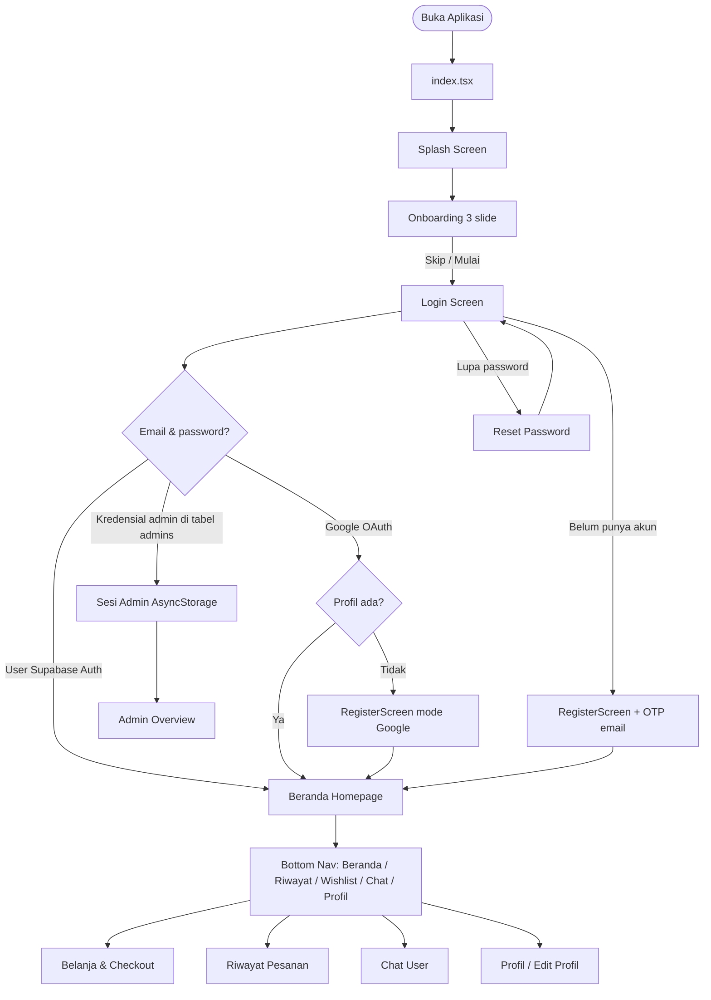
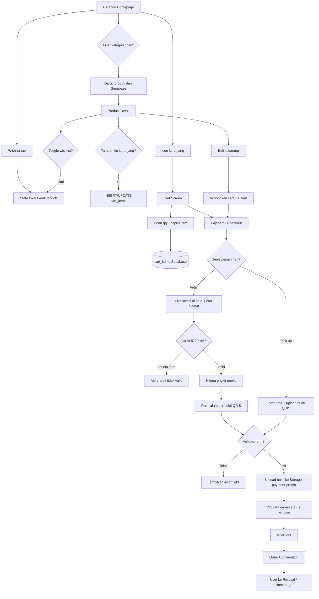
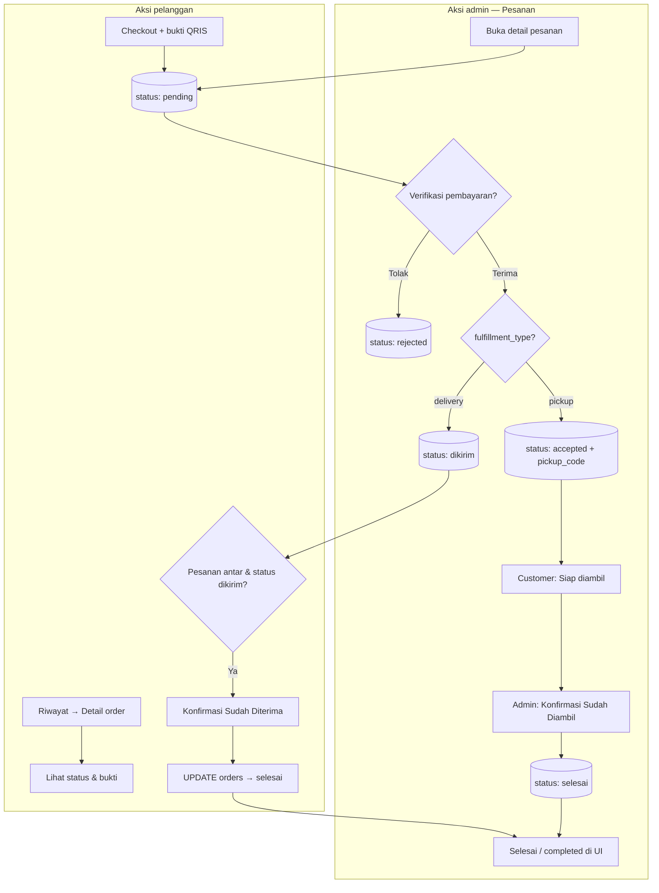
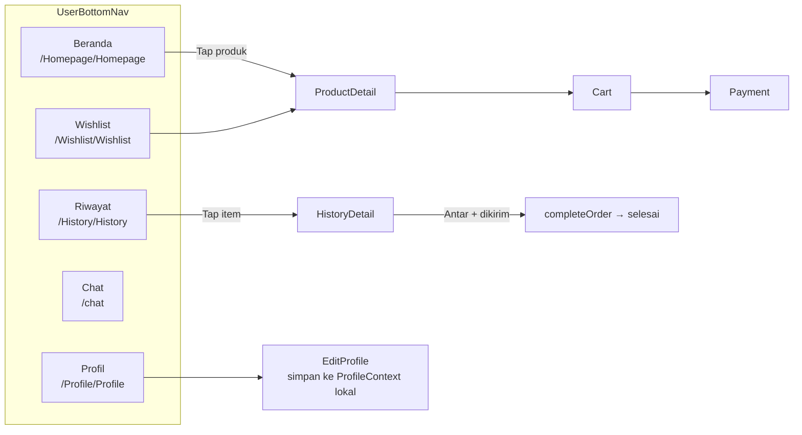
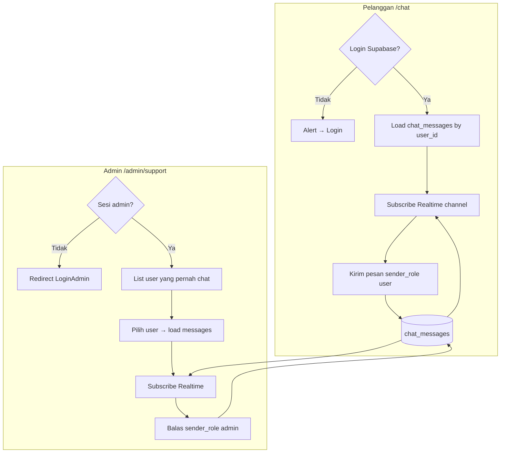
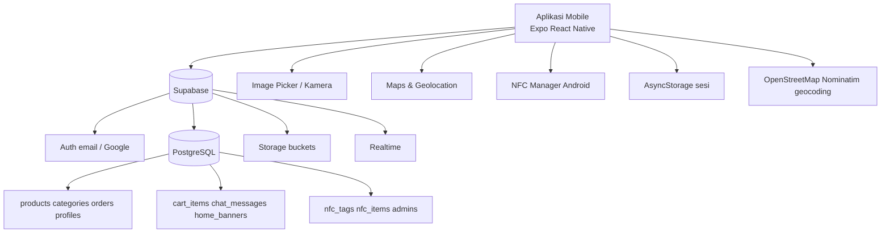

# Flowchart — Toko Juara Kelas

Dokumen ini mendeskripsikan alur aplikasi **Toko Juara Kelas** (React Native / Expo) untuk laporan UAS IF670.  
Diagram menggunakan sintaks **Mermaid** — render di [mermaid.live](https://mermaid.live) lalu export PNG/SVG untuk Word/PDF.

---

## 1. Alur aplikasi keseluruhan (high-level)



---

## 2. Alur autentikasi & sesi

```mermaid
flowchart TD
    subgraph User["Pengguna (Supabase Auth)"]
        L1[Login email + password] --> AUTH{signInWithPassword}
        AUTH -->|Sukses| CLEAR1[clearAdminSession]
        CLEAR1 --> HOME[Beranda]
        AUTH -->|Gagal| ERR1[Alert Login Gagal]

        L2[Login Google] --> OAUTH[signInWithOAuth + WebBrowser]
        OAUTH --> SESS{Session & profil profiles?}
        SESS -->|Profil kosong| REG[RegisterScreen]
        SESS -->|Profil ada| HOME

        R1[Register] --> OTP[Kirim OTP email]
        OTP --> VERIFY[Verifikasi OTP]
        VERIFY --> INSERT[Insert profiles + Auth user]
        INSERT --> HOME

        R2[Lupa password] --> EMAIL_RESET[Supabase resetPasswordForEmail]
        EMAIL_RESET --> LINK[User buka link email]
        LINK --> NEW_PW[Set password baru]
        NEW_PW --> L1
    end

    subgraph Admin["Admin (tabel admins + AsyncStorage)"]
        L3[Login dengan email admin] --> ADM_CHK{Match admins.email & password?}
        ADM_CHK -->|Ya| SIGNOUT[supabase.auth.signOut]
        SIGNOUT --> SAVE[saveAdminSession]
        SAVE --> OVERVIEW[/admin/overview]
        ADM_CHK -->|Tidak| AUTH

        GUARD[Admin _layout guard] -->|Tanpa sesi| LOGIN_ADM[/admin/LoginAdmin]
        GUARD -->|Ada sesi| PANEL[Panel Admin]
        LOGOUT[Keluar dari sidebar] --> CLEAR2[clearAdminSession]
        CLEAR2 --> LOGIN_ADM
    end

    subgraph DeepLink["Deep link /login"]
        DL[/login route] --> DL_CHK{Sesi admin?}
        DL_CHK -->|Ya| OVERVIEW
        DL_CHK -->|Supabase session user?| HOME
        DL_CHK -->|Tidak| L1
    end
```

---

## 3. Alur belanja pengguna (customer journey)



---

## 4. Siklus status pesanan



**Mapping status di UI pelanggan (HistoryContext):**

| Status DB | Tipe | Label UI |
|-----------|------|----------|
| `pending` | semua | Diproses |
| `accepted` | pickup | Siap diambil |
| `dikirim` | delivery | Sedang dikirim |
| `selesai` | semua | Selesai |
| `rejected` / `batal` | semua | Dibatalkan |

---

## 5. Navigasi utama pengguna (bottom navigation)



---

## 6. Alur panel admin

```mermaid
flowchart TD
    LOGIN_A[/admin/LoginAdmin] --> GUARD{Sesi admin valid?}
    GUARD -->|Tidak| LOGIN_A
    GUARD -->|Ya| OVER[Ringkasan /admin/overview]

    OVER --> SB[Admin Sidebar]
    SB --> PROD[Produk CRUD + upload gambar]
    SB --> BAN[Feed Banner CRUD]
    SB --> CAT[Kategori CRUD]
    SB --> NFC[Stok NFC]
    SB --> ORD[Pesanan verifikasi]
    SB --> SUP[Chat /admin/support]
    SB --> USR[Pengguna read-only profiles]
    SB --> THEME[Toggle dark mode]
    SB --> OUT[Logout → clearAdminSession]

    PROD --> DB1[(products + Storage product-images)]
    BAN --> DB2[(home_banners + Storage)]
    CAT --> DB3[(categories)]
    ORD --> DB4[(orders)]
    SUP --> DB5[(chat_messages + Realtime)]
    USR --> DB6[(profiles)]
```

---

## 7. Alur inventori NFC (admin)

```mermaid
flowchart TD
    NFC_PAGE[/admin/inventory-nfc] --> MODE{Mode?}
    MODE -->|Scan| SCAN[NFCScanner baca UID tag]
    MODE -->|Cari UID manual| SEARCH[Input UID]

    SCAN --> ENSURE{Tag ada di nfc_tags?}
    SEARCH --> ENSURE
    ENSURE -->|Tidak| INSERT_TAG[INSERT nfc_tags]
    ENSURE -->|Ya| LOAD[SELECT nfc_items by uid]
    INSERT_TAG --> LOAD

    LOAD --> LIST[Tampil daftar barang]
    LIST --> ADD[+ Tambah barang]
    LIST --> EDIT[Tap barang → edit]
    ADD --> MODAL[NFCItemModal]
    EDIT --> MODAL
    MODAL --> PHOTO[Pilih foto galeri optional]
    PHOTO --> SAVE_ITEM[INSERT/UPDATE nfc_items + Storage]
    SAVE_ITEM --> LIST

    LIST --> RENAME[Simpan nama tag]
    RENAME --> UPDATE_TAG[UPDATE nfc_tags.name]
```

---

## 8. Alur chat dukungan (realtime)



---

## 9. Diagram konteks sistem (data & layanan)



---

## Cara memasukkan ke laporan

1. Buka https://mermaid.live
2. Salin blok ` ```mermaid ` dari file ini
3. Export **PNG** atau **SVG**
4. Sisipkan di bab **Desain Model Aplikasi** dengan caption, misalnya: *Gambar 1. Alur autentikasi pengguna dan admin*

---

*Nama aplikasi: Toko Juara Kelas · Framework: React Native (Expo) · Backend: Supabase*
